# Projeto UniFIAP Pay - Infraestrutura Kubernetes (Kind)
Este repositório contém a solução para o desafio de implantar a infraestrutura da API de pagamentos da fintech UniFIAP Pay. O projeto abrange a containerização da aplicação, publicação de imagens, e a orquestração de workloads no Kubernetes (utilizando Kind) com foco em segurança, persistência e monitoramento.

# 🚀 Tecnologias Utilizadas
Docker & Docker Hub: Para construção e publicação das imagens da aplicação.

Kubernetes (Kind): Para orquestração dos containers em um cluster local.

Node.js (Express): API de exemplo utilizada para simular a aplicação.

WSL2 (Ubuntu): Ambiente de desenvolvimento e execução.

# 📂 Estrutura do Repositório
/fiapbank-k8s
├── /src            # Código-fonte da API de exemplo (Node.js)
├── /docker         # Dockerfile (multi-stage) e docker-compose.yml (para testes locais)
├── /images         # Imagens com as evidências
├── /k8s            # Manifestos YAML do Kubernetes (Deployments, Services, Secrets, etc.)
└── README.md       # Esta documentação

# 🛠️ Como Executar o Projeto
Siga os passos abaixo para construir e implantar a aplicação no cluster Kind.

Pré-requisitos
Docker Desktop (com WSL2)

Kind (Kubernetes in Docker)

kubectl

## Passo 1: Construir e Publicar a Imagem Docker (Tarefa 1)
1- Clone este repositório.

2- Navegue até a raiz do projeto (fiapbank-k8s).

3- Construa a imagem Docker (o . no final é importante):

```bash

docker build -t <nome do usuario >/fiapbank-api:v1 -f docker/dockerfile .

```


4- Faça login no Docker Hub:
```bash
docker login
```

5- Envie a imagem para o Docker Hub:

```bash

docker push <nome do usuario >/fiapbank-api:v1

```
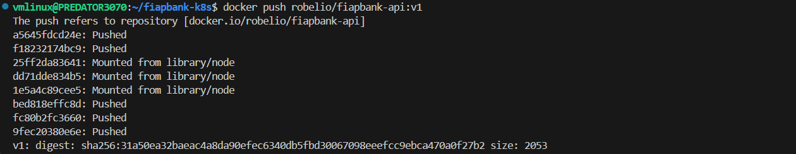

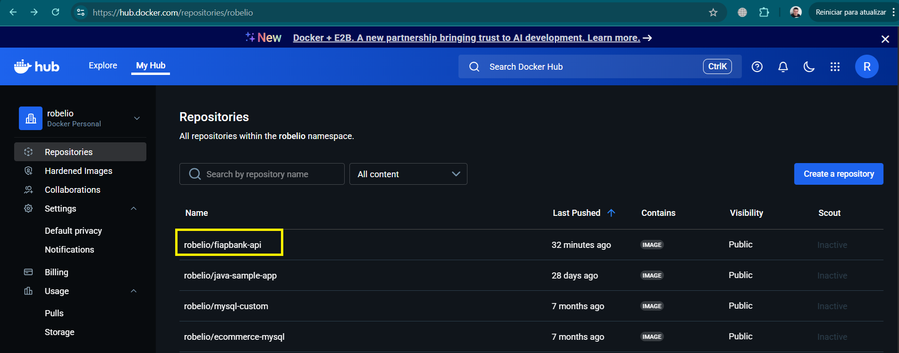

## Passo 2: Criar o Cluster Kind

1- Crie o cluster Kind que servirá como nossa "PSTI Cloud" local:

```bash
kind create cluster --name fiapbank-cluster
```

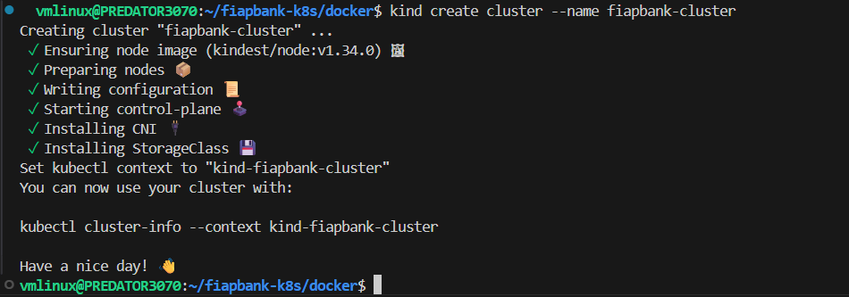

2-Importante: Carregue a imagem buildada localmente para dentro do cluster Kind (isso evita problemas de ImagePullBackOff se o push para o Hub falhar ou para testes mais rápidos):

```bash
kind load docker-image robelio/fiapbank-api:v1 --name fiapbank-cluster
```

## Passo 3: Aplicar os Manifestos Kubernetes (Tarefas 3 & 4)

1- Verifique o Secret: Antes de aplicar, certifique-se que o arquivo k8s/02-db-secrets.yaml contém a senha do banco em Base64. (Ex: echo -n 'senhaSuperSegura123' | base64)

2- Aplique todos os manifestos YAML na ordem correta (ou todos de uma vez):

```bash
kubectl apply -f k8s/
```

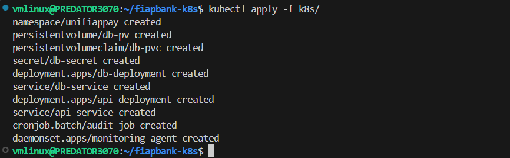

## Passo 4: Testar a Aplicação

1- Verifique se todos os pods estão com o status Running ou Completed:

```bash
kubectl get pods -n unifiappay

```
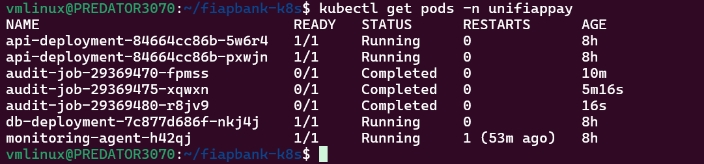

2- Crie um túnel de comunicação (port-forward) do seu localhost para o Service da API dentro do cluster. Abra um novo terminal e deixe este comando rodando:
```bash
kubectl port-forward service/api-service 30080:80 -n unifiappay
```
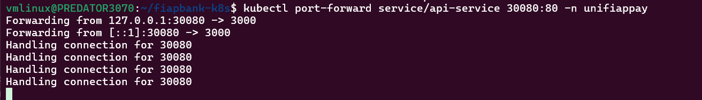

3- No terminal original, acesse a API:

```bash

curl http://localhost:30080

```
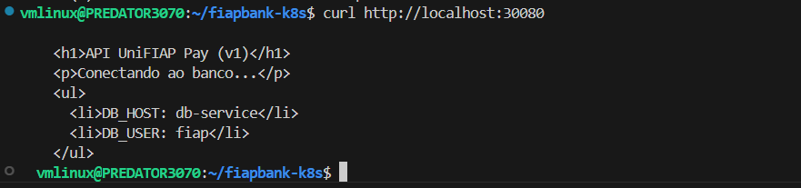

Saída no navegador:

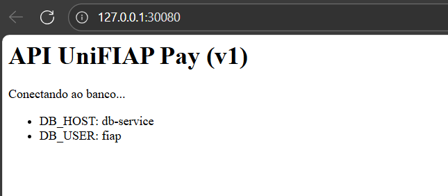

# 📸 Evidências de Execução (Tarefas 1-5)

Abaixo estão as evidências de log e prints que comprovam o funcionamento de cada etapa do projeto.

## Tarefa 1: Imagem Publicada no Docker Hub
Print da imagem robelio/fiapbank-api:v1 disponível no repositório do Docker Hub.

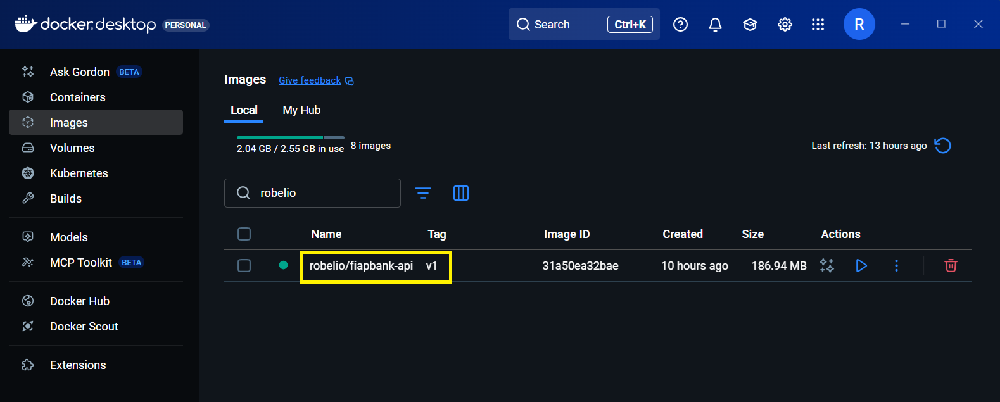

## Tarefa 2: Simulação de Rede Segura com Docker Compose
Teste local (via docker-compose.yml) simulando a comunicação segura entre a API e o banco (pix-db) na rede customizada fiapbank-net.

Prints do 'docker-compose up' e do 'curl http://localhost:3000' MOSTRANDO A API FUNCIONANDO LOCALMENTE COM DOCKER

```bash

 docker-compose up -d

```
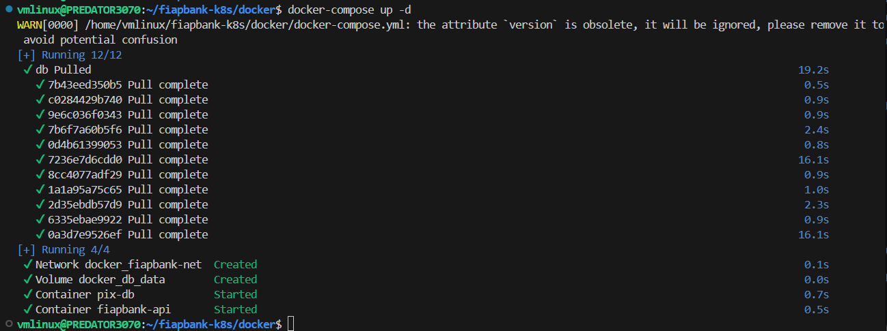


```bash

 curl http://localhost:3000

```
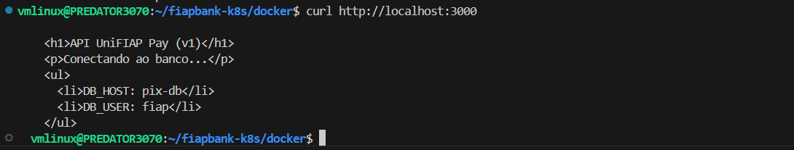

Saída no navegador:

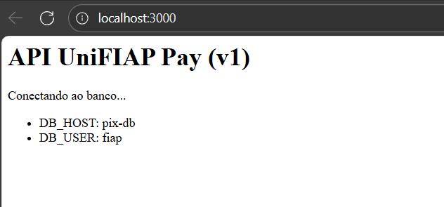

Após o docker-compose é possível listar as redes configuradas:

```bash

 docker network ls

```
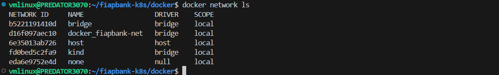

Lista dos containers ativos:

```bash

 docker ls

```
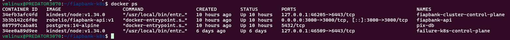

## Tarefa 3 & 4: Status do Cluster Kubernetes (Pods, Jobs, DaemonSet)
Saída do comando kubectl get all -n unifiappay, mostrando os Deployments da API (2 réplicas) e DB, o DaemonSet de monitoramento os Jobs de auditoria concluídos e mais outras informações importantes, tudo num bloco só.

```bash

 kubectl get all -n unifiappay

```
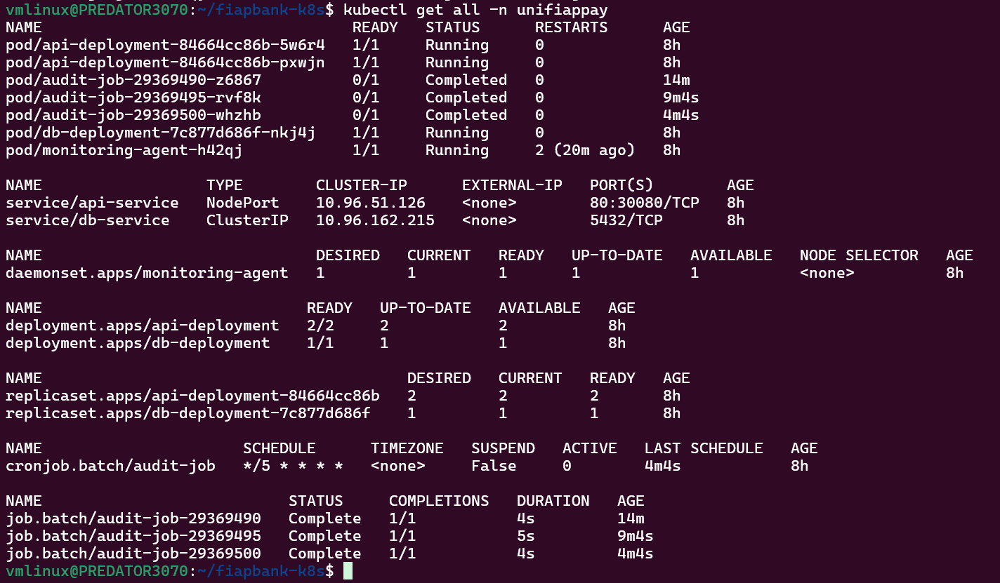

## Tarefa 4: Evidências de Segurança e Limites de Recursos
Saída do comando:
```bash
 kubectl describe pod <nome-do-pod-da-api > -n unifiappay
 ```
 Comprovando a aplicação do securityContext e dos resources (limits e requests).

 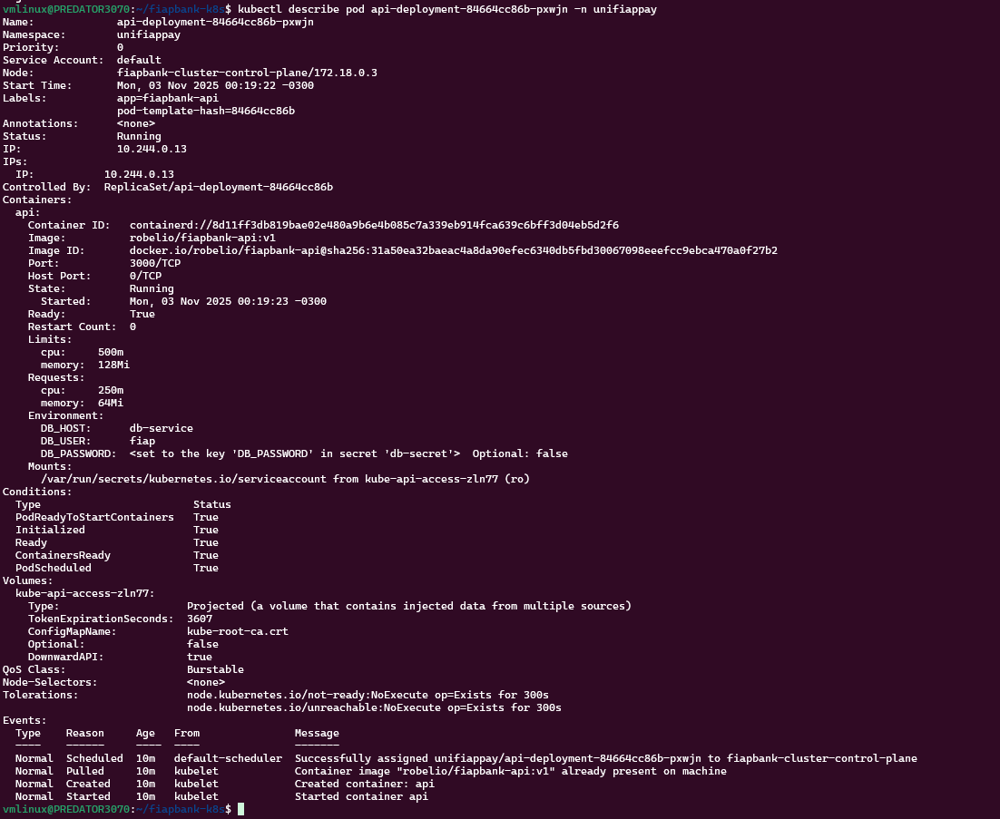


## Tarefa 5: Logs da Aplicação (Evidência Operacional)
Logs dos pods da API, mostrando que a aplicação iniciou com sucesso dentro do cluster.

```bash
kubectl logs -n unifiappay -l app=fiapbank-api
```

API da UniFIAP Pay rodando na porta 3000
API da UniFIAP Pay rodando na porta 3000

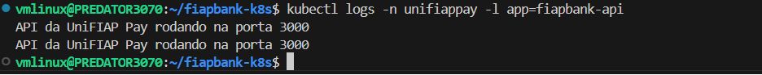


## Tarefa 5: Acesso Externo via port-forward (Evidência Final)
Comprovação de que o Service da API está funcional e roteando tráfego, lendo as variáveis de ambiente (DB_HOST: db-service) injetadas pelo Kubernetes.

```bash

 curl http://localhost:30080

```
<h1>API UniFIAP Pay (v1)</h1>
<p>Conectando ao banco...</p>
<ul>
  <li>DB_HOST: db-service</li>
  <li>DB_USER: fiap</li>
</ul>

